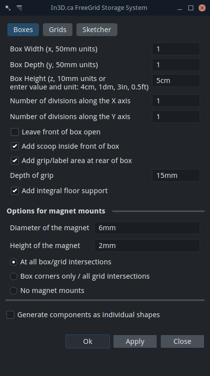

# In3D.ca FreeGrid Storage System

[![Contributions welcome][ContribsW_badge]][ContribsW]
[![license][license_badge]][license]
[![FreeCAD Addon Manager][AddonMgr_badge]][AddonMgr]
[![pre-commit enabled][pre-commit_badge]][pre-commit]
[![Code style: black][black_badge]][black]
[![GitHub Tag][tag_bagde]][tag]
[![Common Changelog][cc_badge]][cc]

This project contains a [FreeCAD](https://freecad.org) workbench for generating FreeGrid storage system components.



## Installation

### Automatic Installation

The recommended way to install FreeGrid is via FreeCAD's
[Addon Manager](https://wiki.freecad.org/Std_AddonMgr) under
`Tools > Addon Manager` dropdown menu.

Search for **FreeGrid** in the workbench category.

### Manual installation

The install path for FreeCAD modules depends on the operating system used.

To find where is the user's application data directory enter next command on
FreeCAD's Python console.

```python
App.getUserAppDataDir()
```

Examples on different OS

* Linux: `/home/user/.local/share/FreeCAD/Mod/`
* macOS: `/Users/user/Library/Preferences/FreeCAD/Mod/`
* Windows: `C:\Users\user\AppData\Roaming\FreeCAD\Mod\`

Use the CLI to enter the `Mod` directory and use Git to install FreeGrid:

```shell
git clone https://github.com/instancezero/in3dca-freegrid.git FreeGrid
```

If you are updating the code, restarting FreeCAD is advised.

## Community/Contributing

If you use FreeGrid or add components to it, please let me know! If you have models
on Cults, tag them with In3D and FreeGrid.

You can find In3D:

* on the web at [In3D.ca](https://in3d.ca)
* at [Cults3D](https://cults3d.com/en/users/In3d/creations)
* as @in3dca on [Instagram](https://www.instagram.com/in3dca/) and [Twitter](https://twitter.com/in3dca)
* on [Facebook](https://www.facebook.com/in3dca)

Bug reports, coding questions, and pull requests are welcome on Github.

Read our [CONTRIBUTING](./CONTRIBUTING.md) file to know about ways how to help
on the FreeCAD workbench.

## History

This project was initially inspired by [Alexandre Chappel's](https://www.youtube.com/watch?v=OsLc76k4KeM) workshop
organization system. But I wanted to design some of my own components and there were no CAD files available.

So I started working on my own, but like many projects it got shuffled aside. Then I got a CNC router and
my limited workspace turned into an unmanageable mess. I thought I'd do another search before returning to my project
and found Zack Freedman's [Gridfinity system](https://www.youtube.com/watch?v=ra_9zU-mnl8). Perfect, here's a free
system that saves be going back to my design-from-scratch approach!

Alas, nothing is perfect. So here's my "more perfect for me" alternative. I hope others will find it worthwhile.

## A Digression: 3D Printing and CAD

The 3D printing community has a love affair with Autodesk's Fusion 360. After all, it's free, why not?

But Fusion is only free as in "no cost for limited use", not free as in freedom. I'm never comfortable with systems that
are only free until someone decides to change the terms overnight.

Fusion 360 is certainly more powerful than FreeCAD, for most of what I do there aren't enough advantages to prefer it.
Also, I'm a software developer: "parametric" CAD systems are great, but my concept of parameters is higher level. It's
great that you can go into different shapes to adjust and change a design, but when those parameters are deeply nested,
this is still a tricky process. For me, parameters are something you supply to a block of code to get the object you
want; the underlying code should be responsible for working out the details. FreeCAD's macros give me the capability of
doing just that. Fusion 360 doesn't even come close.

## Back to "not quite perfect"

Gridfinity looks great. Actually it's fantastic. There's a rule for ADD people that if something is out of
sight, it ceases to exist. Zach's system really helps with this problem: most of his components keep things visible
while still keeping them organized. His glass-front modules are inspired. I'll probably make a version of those soon.
It's also totally free. It's really taken off and that's good for pretty much everyone.

I enthusiastically printed out a few of his modules and ran into some things I wasn't really happy with:

* He uses Fusion 360. Importing his work wasn't possible, unless I just wanted a bunch of primitives.
  This means no parameters at all and that's essentially useless.
* His grid size is 42mm, which seems odd. I think he picked it so his grids would fit perfectly in his shop drawers.
  In my case, I've got big hands and getting two fingers into a 42mm 1x1 box to fish out a small part simply doesn't
  work that well.
* The default boxes come in a 24mm height. The system I was working on used multiples of 10mm. I am more
  comfortable with that. Also, anything in the range of 25mm feels like an inch. Eeew.

All this inspired me to take another look at my system. As it turns out, it was most of the way there. It uses a
50mm grid, 10mm unit height. The design is slightly more angular but I kind of prefer that anyway.

What was missing is something that made it easy for non-programmers to generate components. So I added a user interface,
cleaned the code up, and made it available to everyone. I hope to add more "standard" objects to the system, but with
basic resizeable grids and boxes, it's already got a lot of flexibility: generate a core box and then customize to fit
your needs.

## Individual Components

The option "Generate components as individual shapes" will create a box with dividers, the front "scoop" and the label
area all as separate FreeCAD shapes. By default, dividers split the inside of the box evenly, but what if you want a
different allocation of space? Simple: use the individual components feature, then reposition the dividers, and form a
union to get the custom box you need.

## Generating and Printing

The bigger the grid/box, the more complex the computations. Generating a 5x5 grid with magnets can take a few seconds,
depending on the speed of your system. Be patient.

Boxes have hollow bottoms, and need to be printed with supports. Prusa Slicer's "paint on" supports are great for
getting the bottoms supported without generating needless supports around the outside. Alternatively FreeGrid can
generate floor support for you to reduce the length of the bridges.

Longer parts can be subject to warping, so good bed adhesion is critical. A while back I switched to a PEI coated
flexible steel bed. I can't say enough good things about that choice. Well worth the cost in saved time, tape, glue,
failed prints, and frustration.

As of version 1.0, the base grids have a little corner detail that was designed to make it possible to add a coupling
and link grids together more securely. The current design is too detailed to be useful and a better version is on
the way. Your slicer might want to add supports there, but it's not necessary.

## Magnets

The magnets are entirely optional, but really help to keep things in place. Use 6x2mm magnets commonly available in
packs of 100 or more. It's important to pick one magnet orientation for the grid and the opposite for the modules.
It's possible to change the size of the magnet modifying the diameter and height, this also allows to make small
adjustments to the dimensions when the 3D printer lacks of precision.

## Dividers

It's possible to create dividers parallel to both X and Y axis that split the inside evenly to create a grid
inside of the box.

## Subtractive manufacturing for grids

Originally the FreeGrid system was thought to be manufactured using an additive process: 3D printing. The problem
is that the used material and time needed to complete a big grid can be exaggeratedly large. In order to address
this problem we can make use of another manufacturing process as CNC machining. Now we can save some minutes and
a few bucks if instead of plastic filament we use a wood/acrylic board to carve the grid shape.

[ContribsW]: ./CONTRIBUTING.md
[ContribsW_badge]: https://img.shields.io/badge/contributions-welcome-brightgreen.svg?style=flat
[license]: ./LICENSE
[license_badge]: https://img.shields.io/github/license/instancezero/in3dca-freegrid
[AddonMgr]: https://github.com/FreeCAD/FreeCAD-addons
[AddonMgr_badge]: https://img.shields.io/badge/FreeCAD%20addon%20manager-available-brightgreen
[pre-commit]: https://github.com/pre-commit/pre-commit
[pre-commit_badge]: https://img.shields.io/badge/pre--commit-enabled-brightgreen?logo=pre-commit
[black]: https://github.com/psf/black
[black_badge]: https://img.shields.io/badge/code%20style-black-000000.svg
[tag]: https://github.com/instancezero/in3dca-freegrid/releases
[tag_bagde]: https://img.shields.io/github/v/tag/instancezero/in3dca-freegrid
[cc_badge]: <https://common-changelog.org/badge.svg>
[cc]: <./CHANGELOG.md>
